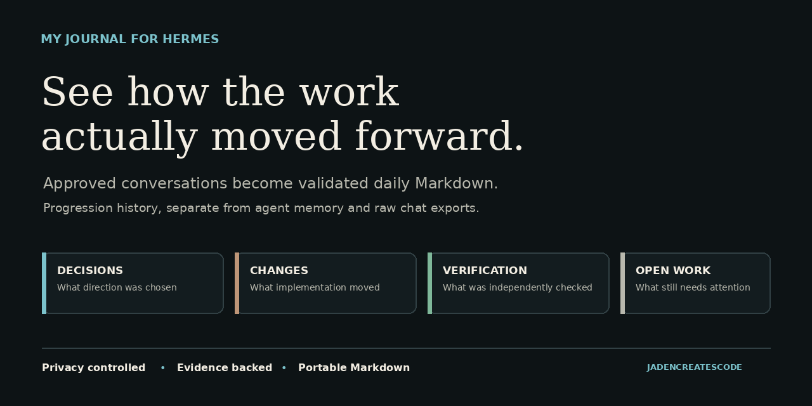

# My Journal for Hermes

**See how your work actually moved forward.**

My Journal `0.2.0` turns Hermes conversations you explicitly approve into a validated daily record of decisions, changes, failed attempts, verification, blockers, corrections, and open work. Canonical entries are portable Markdown you can read in Obsidian, search, sync, back up, or move.

It is a progression journal, not another memory system and not a raw transcript export.

[](https://jadencreatescode.github.io/my-journal/)

The preview and every public example use synthetic data.

## About the creator

Jaden Gibson grew up in Las Vegas, a city whose constant reinvention helped shape his curiosity about how systems work. He immersed himself in coding out of genuine interest and learned by building practical tools that connect artificial intelligence, personal knowledge, and the devices people use every day.

His current work includes My Journal for Hermes, which turns approved conversations into private, evidence backed daily progress notes, and the [Hermes Mobile Control Center](https://github.com/Jadencreatescode/hermes-mobile-community), which brings the Hermes desktop experience to phones and foldable devices. Both projects reflect a focus on useful software, user ownership, privacy, access across devices, and open collaboration.

## Why it is different

| Raw chat history | Agent memory | My Journal |
| --- | --- | --- |
| Shows what was said, including repetition and tool noise | Keeps compact durable facts useful in future conversations | Shows what changed over time, what passed verification, and what remains unfinished |

## What it gives you

1. **Daily progression, not another chat dump.** Each note separates what was discussed, decided, attempted, completed, verified, blocked, and corrected.
2. **Scope you choose first.** Profiles, platforms, dates, timezone, privacy settings, exclusions, and workload limits are explicit before generation.
3. **Evidence backed notes.** Read only collection creates bounded evidence, masks personal information, redacts likely secrets, and preserves nonreversible coverage references.
4. **Historical backfill that can continue.** Approved activity dates run oldest first, and interrupted evidence resumes from frozen evidence instead of being recollected.
5. **Validated daily automation.** Required precollection freezes evidence before the scheduled agent starts. Required postvalidation and a locked execution contract prevent partial work from being reported as complete.
6. **Portable ownership.** Canonical entries remain plain Markdown under your Hermes data root.

## Try it without private data

The synthetic demonstration does not read Hermes conversations, configuration, credentials, a model provider, or a network service.

Print a temporary example and remove it automatically:

```text
python3 scripts/demo.py --ephemeral
```

Or create a browsable synthetic Journal tree:

```text
python3 scripts/demo.py --output ./my-journal-demo
```

## Release status

Version `0.2.0` supports Linux, macOS, Ubuntu under WSL, and native Windows Hermes when Ubuntu WSL provides the restricted Journal helper. On Windows, the native Hermes installation remains the conversational owner. WSL performs only the restricted Journal filesystem and collection work.

Review `PRIVACY.md`, `SECURITY.md`, and `THREAT_MODEL.md` before enabling collection.

## Package boundary

1. `skills/note-taking/my-journal` owns collection, evidence, privacy controls, digest receipts, validation, and note templates.
2. `skills/note-taking/journal` owns conversational journal requests.
3. `plugins/my-journal` owns 11 deterministic journal tools, five restricted generation tools, and `hermes journal`.
4. `install.py` owns transactional installation, restore, uninstall, and interrupted activation recovery.

Markdown under `journal/notes/YYYY/MM/YYYY-MM-DD.md` is canonical. Semantic stores are optional mirrors.

## Requirements

1. Linux, macOS, or native Windows Hermes with Ubuntu WSL available for the restricted Journal runtime.
2. Python 3.11, 3.12, or 3.13.
3. A Hermes Agent installation with skills, standalone plugins, native cron management, and noninteractive chat.
4. An IANA timezone available through Python `zoneinfo`.

On native Windows, Hermes owns the plugin, skills, tools, and model interaction. Ubuntu WSL performs only the restricted Journal runtime. It does not run a second conversational Hermes agent. The obsolete WSL Hermes installation is not required by the bridge.

## Install

Run the installer with the Hermes home used by the target agent:

```text
python3 install.py --hermes-home /path/to/hermes/home
```

On native Windows, run the PowerShell wrapper from the extracted release. It keeps native Hermes as the conversational owner and runs the transactional installer inside Ubuntu WSL:

```powershell
.\install-windows.ps1 -HermesHome "$env:LOCALAPPDATA\hermes" -Distro Ubuntu
```

Use the same wrapper for lifecycle operations:

```powershell
.\install-windows.ps1 -HermesHome "$env:LOCALAPPDATA\hermes" -Distro Ubuntu -Upgrade
```

```powershell
.\install-windows.ps1 -HermesHome "$env:LOCALAPPDATA\hermes" -Distro Ubuntu -Restore
```

```powershell
.\install-windows.ps1 -HermesHome "$env:LOCALAPPDATA\hermes" -Distro Ubuntu -Recover
```

```powershell
.\install-windows.ps1 -HermesHome "$env:LOCALAPPDATA\hermes" -Distro Ubuntu -Uninstall
```

Enable the plugin:

```text
hermes plugins enable my-journal
```

Start a new Hermes process or restart the Hermes gateway. Verify:

```text
hermes journal status
```

```text
hermes journal resolve-range "last 7 days"
```

## Guided first use

Start with metadata inventory. This lists available profile and platform labels without reading message bodies:

```text
hermes journal setup-inventory
```

Databases up to 8 GiB use the normal tier. Inventory stops before opening a larger database and reports an exact approval phrase for the smallest sufficient 16 GiB or 32 GiB tier. Approve that profile tier, then repeat inventory:

```text
hermes journal setup-database-approve PROFILE --confirm "EXACT PHRASE"
```

Databases above 32 GiB remain blocked and require a separately reviewed bounded sharding or indexing procedure.

Create a read only approval plan with explicit scope, timezone, and privacy choices:

```text
hermes journal setup-plan --profile default --platform discord --timezone America/Los_Angeles --pii-mode mask --entropy-mode report
```

The planner scans eligible timestamps only, finds the earliest and latest eligible local activity dates, reports exact activity dates and workload, selects the smallest sufficient daily message tier from 25,000, 50,000, and 100,000, subtracts already validated notes, and writes an immutable random-ID plan. Optional `--start-date`, `--end-date`, and repeated `--exclude-session` arguments narrow the proposal. Persistent Hermes memory does not determine the historical start date.

Review the complete output. Approval requires the exact generated phrase:

```text
hermes journal setup-approve PLAN_ID --confirm "EXACT GENERATED PHRASE"
```

Approval rechecks retained source metadata, writes the enabled configuration, and generates only approved missing activity dates, oldest first. Completed and failed dates are reported separately. Repeating a partial approval retries only unfinished dates. Native daily scheduling is offered only after every approved date succeeds and is never enabled automatically.

## Explicit configuration

Guided approval creates `journal/config.json`. Manual operators may instead copy `skills/note-taking/my-journal/templates/config.json` to that location. The shipped manual template has `enabled` set to `false`.

A valid enabled configuration must explicitly name at least one profile and platform:

```json
{
  "schema_version": 1,
  "enabled": true,
  "timezone": "America/Los_Angeles",
  "profiles": ["default"],
  "platforms": ["cli"],
  "excluded_session_ids": [],
  "database_size_approvals": {},
  "privacy": {
    "redact_secrets": true,
    "pii_mode": "mask",
    "entropy_mode": "report"
  },
  "limits": {
    "max_message_chars": 4000,
    "max_tool_chars": 1200,
    "max_selected_messages": 25000,
    "max_retained_chars": 4000000,
    "max_sessions": 2000,
    "packet_chunk_bytes": 120000,
    "max_packet_chunks": 64
  }
}
```

The guided planner may select 25,000, 50,000, or 100,000 selected messages per activity date. Configuration cannot exceed the absolute 100,000 ceiling. Secret redaction cannot be disabled.

If a later date outgrows the approved daily tier, generation stops before collector launch and returns the exact next tier and confirmation phrase. Check and approve only that capacity change, then retry the same date:

```text
hermes journal workload-check 2026-07-27
hermes journal workload-approve 2026-07-27 --confirm "EXACT PHRASE"
```

The blocked date triggers the approval, but the approved 50,000 or 100,000 tier becomes the global daily capacity for future dates too. It does not authorize only the triggering date. The targeted property means only daily capacity changes; profiles, platforms, exclusions, timezone, privacy, database limits, and all other resource ceilings remain unchanged.

Configured higher tiers are not sufficient by themselves. Collection validates matching descriptor anchored database and daily approval receipts before SQLite opens. Purge preserves `config.json` but removes those receipts, so higher tiers fail closed until the corresponding database or workload check is repeated and its exact phrase is approved again.

Approval publication is retry safe. If durable evidence is written but configuration publication is interrupted, repeating the same exact database or daily phrase completes the missing configuration update instead of requiring a wider approval.

Daily workload tiers never increase silently. A date above 100,000 eligible messages remains blocked for a separately reviewed bounded strategy.

Timezone precedence is:

1. Nonempty `MY_JOURNAL_TIMEZONE`.
2. `journal/config.json`.
3. Host local timezone.

## Commands

Read only commands:

```text
hermes journal status
hermes journal gaps "last 90 days"
hermes journal backfill-plan "last 30 days"
hermes journal preview "last 30 days"
hermes journal resolve-range "last month"
hermes journal maintenance
hermes journal setup-inventory
```

Generation commands use Hermes with the dedicated `my-journal-generation` toolset. It exposes only five bounded journal operations and excludes terminal, web, general file, delegation, messaging, MCP, and unrelated plugin tools. Generation verifies that validated canonical notes exist before reporting success:

```text
hermes journal generate 2026-07-27
hermes journal backfill "last 30 days"
```

Daily scheduling uses a Hermes native agent cron job with a required pre-run script.
On native Windows, the same command keeps durable ownership and locking inside WSL while a fixed native Python worker performs only create, list, and remove against the Windows Hermes cron API. The WSL lock remains held across native creation and receipt commit, so an interrupted setup resumes from the durable intent instead of duplicating or orphaning the job. Hermes executes the trusted precollector before constructing the agent or its session database. A collection failure aborts the tick before any agent starts. After evidence is frozen, the normal cron agent remains pinned to the `my-journal-generation` toolset and the `my-journal` skill, so all normal scheduler model, provider, session, and delivery protections remain active. Setup accepts five field cron expressions or explicit intervals such as `every 1h`. It persists durable exact ownership intent before creation, verifies the complete structured native job after creation, reuses an exact existing owned job, and removes only jobs matching that intent:

```text
hermes journal cron-setup --schedule "0 11 * * *" --deliver local
hermes journal cron-remove
```

When native Windows Hermes should operate an existing canonical WSL home instead of the Windows mounted home, bind it explicitly during setup. The normalized path is persisted under the native Hermes home and reused by every later Journal command and scheduled tool call.

```text
hermes journal cron-setup --schedule "0 11 * * *" --deliver local --wsl-hermes-home /home/exampleuser/.hermes
```

On native Windows, the equivalent native Hermes agent job uses `my-journal-daily/precollect.py` with `required_prerun` enabled. The script invokes the restricted Ubuntu WSL Journal runtime and freezes the previous configured local date before native Hermes constructs the scheduled synthesis agent.

Purge previews owned journal data without writing:

```text
hermes journal purge
```

Applying purge preserves `config.json` and requires both the apply flag and exact confirmation phrase:

```text
hermes journal purge --apply --confirm "DELETE MY JOURNAL DATA"
```

## Upgrade and recovery

Upgrade transactionally:

```text
python3 install.py --hermes-home /path/to/hermes/home --upgrade
```

Restore the previous installation snapshot. Restore refuses locally modified installed components unless force is explicit:

```text
python3 install.py --hermes-home /path/to/hermes/home --restore
python3 install.py --hermes-home /path/to/hermes/home --restore --force
```

Recover an install, restore, or uninstall interrupted by process death:

```text
python3 install.py --hermes-home /path/to/hermes/home --recover
```

Uninstall code while preserving journal data:

```text
python3 install.py --hermes-home /path/to/hermes/home --uninstall
```

Modified installed code is protected. Explicit replacement or removal requires `--force` with `--restore` or `--uninstall`. Lifecycle operations use one advisory lock per Hermes home and refuse concurrent execution.

## Privacy summary

1. Collection is disabled until explicitly enabled.
2. Profiles and platforms use explicit allowlists.
3. Public evidence replaces raw session identifiers with nonreversible coverage references.
4. Chat identifiers, thread identifiers, and absolute database paths are omitted from public evidence.
5. Credentials are redacted and common PII can be masked.
6. Model generation can send bounded evidence to the provider configured in Hermes.
7. Redaction reduces risk but does not prove complete secret removal.

## Validation contract

Completion fails closed unless manifest shape, timezone window, evidence identity, counts, coverage, privacy policy, digest receipts, required headings, provenance, and canonical date all reconcile. Canonical note and completion state publication roll back together if validator publication fails. A durable completion chain binds the retained receipt, exact receipt archive, state, evidence manifest, and canonical note by SHA256 and filesystem identity, then rechecks every live artifact before success. Any later mismatch leaves the run active. Reads return the exact validated snapshot and do not mutate completion state.

## Development and release

Run the three suites separately:

```text
python3 -m unittest discover -s tests -v
python3 -m unittest discover -s plugins/my-journal/tests -v
python3 -m unittest discover -s skills/note-taking/my-journal/tests -v
```

The deterministic release archive is built only from a Git reference:

```text
python3 scripts/build_release.py --ref v0.2.0 --output dist
python3 scripts/verify_release.py --ref v0.2.0 --archive dist/my-journal-v0.2.0.tar.gz
```

See `CONTRIBUTING.md`, `COMPATIBILITY.md`, and `CHANGELOG.md` for the complete release boundary.
